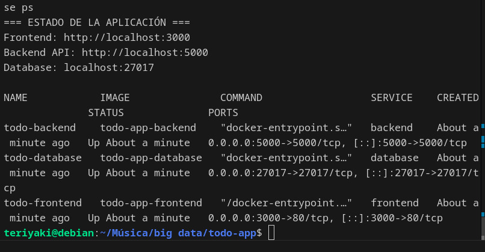

# Aplicación de Gestión de Tareas con Docker

Una aplicación web completa para gestionar tareas, implementada con una arquitectura de microservicios utilizando Docker. La aplicación consta de tres contenedores principales: frontend (React), backend (Node.js/Express) y base de datos (MongoDB).

## Índice

- [Estructura del Proyecto](#estructura-del-proyecto)
- [Tecnologías Utilizadas](#tecnologías-utilizadas)
- [Arquitectura de la Aplicación](#arquitectura-de-la-aplicación)
- [Configuración de Contenedores](#configuración-de-contenedores)
- [Dockerfiles - Código Importante](#dockerfiles---código-importante)
- [Docker Compose - Orquestación](#docker-compose---orquestación)
- [API REST - Endpoints](#api-rest---endpoints)
- [Código Frontend - Componentes Clave](#código-frontend---componentes-clave)
- [Código Backend - Servidor y Base de Datos](#código-backend---servidor-y-base-de-datos)
- [Instalación y Ejecución](#instalación-y-ejecución)
- [Capturas de Pantalla](#capturas-de-pantalla)
- [Funcionalidades de la Aplicación](#funcionalidades-de-la-aplicación)
- [Interacción entre Contenedores](#interacción-entre-contenedores)
- [Resolución de Problemas](#resolución-de-problemas)
- [Consideraciones de Seguridad](#consideraciones-de-seguridad)
- [Enlaces y Recursos](#enlaces-y-recursos)

## Estructura del Proyecto

```
todo-app/
├── frontend/                 # Aplicación React
│   ├── src/
│   │   ├── App.js           # Componente principal
│   │   ├── index.js         # Punto de entrada
│   │   └── index.css        # Estilos CSS
│   ├── public/
│   │   └── index.html       # Plantilla HTML
│   ├── Dockerfile           # Imagen Docker del frontend
│   ├── nginx.conf           # Configuración de Nginx
│   └── package.json         # Dependencias del frontend
├── backend/                  # API REST con Node.js
│   ├── server.js            # Servidor Express
│   ├── Dockerfile           # Imagen Docker del backend
│   ├── package.json         # Dependencias del backend
│   └── .env                 # Variables de entorno
├── database/                 # Base de datos MongoDB
│   ├── Dockerfile           # Imagen Docker de MongoDB
│   └── init-mongo.js        # Script de inicialización
├── imagenes/                 # Capturas de pantalla del proyecto
│   ├── interfaz-principal.jpeg    # Página principal de la aplicación
│   ├── nueva-tarea.jpeg          # Formulario de creación de tareas
│   ├── tareas-completadas.jpeg   # Lista de tareas con estados
│   ├── api-respuesta.jpeg        # Respuesta JSON de la API
│   └── docker-containers.jpeg    # Contenedores en ejecución
├── docker-compose.yml       # Orquestación de contenedores
├── .gitignore              # Archivos ignorados por Git
└── README.md               # Documentación del proyecto
```

## Tecnologías Utilizadas

### Frontend
- **React 18**: Framework de JavaScript para interfaces de usuario
- **Axios**: Cliente HTTP para comunicación con la API
- **Nginx**: Servidor web para servir archivos estáticos
- **CSS3**: Estilos personalizados sin frameworks externos

### Backend
- **Node.js**: Entorno de ejecución de JavaScript
- **Express.js**: Framework web para Node.js
- **Mongoose**: ODM para MongoDB
- **CORS**: Middleware para permitir peticiones cross-origin
- **dotenv**: Gestión de variables de entorno

### Base de Datos
- **MongoDB 7.0**: Base de datos NoSQL orientada a documentos

### Contenedorización
- **Docker**: Plataforma de contenedorización
- **Docker Compose**: Herramienta para definir aplicaciones multi-contenedor

## Arquitectura de la Aplicación

### Contenedores y Comunicación

1. **Contenedor Frontend (puerto 3000)**
   - Ejecuta una aplicación React servida por Nginx
   - Se comunica con el backend a través de proxy reverso
   - Maneja la interfaz de usuario y las interacciones del usuario

2. **Contenedor Backend (puerto 5000)**
   - API REST construida con Node.js y Express
   - Maneja la lógica de negocio y operaciones CRUD
   - Se conecta a MongoDB para persistencia de datos

3. **Contenedor Database (puerto 27017)**
   - Base de datos MongoDB para almacenar las tareas
   - Datos persistidos mediante volúmenes de Docker
   - Inicializada con datos de ejemplo

### Flujo de Datos

1. **Usuario → Frontend**: Interacción a través del navegador web
2. **Frontend → Backend**: Peticiones HTTP a la API REST
3. **Backend → Database**: Consultas y operaciones en MongoDB
4. **Database → Backend → Frontend → Usuario**: Respuesta con los datos

### Red de Comunicación

Los contenedores se comunican a través de una red Docker personalizada llamada `todo-network`:

- **Frontend**: Accesible desde el host en `http://localhost:3000`
- **Backend**: Accesible internamente como `backend:5000`
- **Database**: Accesible internamente como `database:27017`

## Configuración de Contenedores

### Dockerfile del Frontend

El frontend utiliza un build multi-etapa:
1. **Etapa de construcción**: Compila la aplicación React
2. **Etapa de producción**: Sirve los archivos estáticos con Nginx

Características principales:
- Imagen base: `node:18-alpine` (construcción) y `nginx:alpine` (producción)
- Puerto expuesto: 80
- Proxy reverso configurado para redirigir llamadas API al backend

### Dockerfile del Backend

El backend utiliza una imagen de Node.js:
- Imagen base: `node:18-alpine`
- Puerto expuesto: 5000
- Instala dependencias y ejecuta el servidor Express
- Variables de entorno para configuración de base de datos

### Dockerfile de la Base de Datos

La base de datos utiliza la imagen oficial de MongoDB:
- Imagen base: `mongo:7.0`
- Puerto expuesto: 27017
- Script de inicialización para crear datos de ejemplo
- Volumen persistente para almacenar datos

## Dockerfiles - Código Importante

### Frontend Dockerfile

```dockerfile
# Etapa de construcción
FROM node:18-alpine as build

# Establecer el directorio de trabajo
WORKDIR /app

# Copiar package.json y package-lock.json
COPY package*.json ./

# Instalar dependencias
RUN npm install

# Copiar el código fuente
COPY . .

# Construir la aplicación para producción
RUN npm run build

# Etapa de producción
FROM nginx:alpine

# Copiar los archivos construidos desde la etapa anterior
COPY --from=build /app/build /usr/share/nginx/html

# Copiar configuración personalizada de nginx
COPY nginx.conf /etc/nginx/conf.d/default.conf

# Exponer el puerto 80
EXPOSE 80

# Comando para ejecutar nginx
CMD ["nginx", "-g", "daemon off;"]
```

**Explicación del Frontend Dockerfile:**
- **Build multi-etapa**: Optimiza el tamaño final de la imagen
- **Primera etapa**: Compila React usando Node.js
- **Segunda etapa**: Sirve archivos estáticos con Nginx
- **Configuración Nginx**: Proxy reverso para comunicación con backend

### Backend Dockerfile

```dockerfile
# Usar la imagen oficial de Node.js como base
FROM node:18-alpine

# Establecer el directorio de trabajo en el contenedor
WORKDIR /app

# Copiar package.json y package-lock.json (si existe)
COPY package*.json ./

# Instalar las dependencias
RUN npm install

# Copiar el código fuente de la aplicación
COPY . .

# Exponer el puerto en el que la aplicación se ejecutará
EXPOSE 5000

# Comando para ejecutar la aplicación
CMD ["npm", "start"]
```

**Explicación del Backend Dockerfile:**
- **Imagen Alpine**: Versión ligera de Linux para menor tamaño
- **Instalación por capas**: Aprovecha cache de Docker
- **Puerto 5000**: Expuesto para comunicación con frontend
- **CMD**: Ejecuta el servidor Express

### Database Dockerfile

```dockerfile
# Usar la imagen oficial de MongoDB
FROM mongo:7.0

# Crear directorio para scripts de inicialización
RUN mkdir -p /docker-entrypoint-initdb.d

# Copiar script de inicialización (opcional)
COPY init-mongo.js /docker-entrypoint-initdb.d/

# Exponer el puerto de MongoDB
EXPOSE 27017

# MongoDB se inicia automáticamente con la imagen base
```

**Explicación del Database Dockerfile:**
- **Imagen oficial MongoDB**: Garantiza estabilidad y rendimiento
- **Script de inicialización**: Crea datos de ejemplo al iniciar
- **Puerto 27017**: Puerto estándar de MongoDB
- **Auto-inicio**: MongoDB se ejecuta automáticamente

## Docker Compose - Orquestación

### Archivo docker-compose.yml Completo

```yaml
services:
  # Base de datos MongoDB
  database:
    build: ./database
    container_name: todo-database
    restart: unless-stopped
    ports:
      - "27017:27017"
    environment:
      MONGO_INITDB_DATABASE: todoapp
    volumes:
      - mongodb_data:/data/db
      - ./database/init-mongo.js:/docker-entrypoint-initdb.d/init-mongo.js:ro
    networks:
      - todo-network

  # Backend API (Node.js/Express)
  backend:
    build: ./backend
    container_name: todo-backend
    restart: unless-stopped
    ports:
      - "5000:5000"
    environment:
      - PORT=5000
      - MONGODB_URI=mongodb://database:27017/todoapp
      - NODE_ENV=production
    depends_on:
      - database
    volumes:
      - ./backend:/app
      - /app/node_modules
    networks:
      - todo-network

  # Frontend (React)
  frontend:
    build: ./frontend
    container_name: todo-frontend
    restart: unless-stopped
    ports:
      - "3000:80"
    environment:
      - REACT_APP_API_URL=http://localhost:5000/api
    depends_on:
      - backend
    networks:
      - todo-network

# Volúmenes para persistencia de datos
volumes:
  mongodb_data:
    driver: local

# Red personalizada para comunicación entre contenedores
networks:
  todo-network:
    driver: bridge
```

**Configuración Clave del Docker Compose:**

1. **Dependencias**: `depends_on` asegura orden de inicio correcto
2. **Redes**: Red personalizada `todo-network` para comunicación interna
3. **Volúmenes**: Persistencia de datos MongoDB
4. **Variables de entorno**: Configuración específica para cada servicio
5. **Puertos**: Mapeo de puertos host:contenedor

## API REST - Endpoints

### Tareas (Tasks)

| Método | Endpoint | Descripción |
|--------|----------|-------------|
| GET | `/api/tasks` | Obtener todas las tareas |
| POST | `/api/tasks` | Crear una nueva tarea |
| PUT | `/api/tasks/:id` | Actualizar una tarea específica |
| DELETE | `/api/tasks/:id` | Eliminar una tarea específica |

### Estructura de Datos

```json
{
  "_id": "ObjectId",
  "title": "String (requerido)",
  "description": "String (opcional)",
  "completed": "Boolean (default: false)",
  "createdAt": "Date (automático)"
}
```

### Ejemplo de Petición POST

```json
{
  "title": "Completar proyecto Docker",
  "description": "Crear aplicación con 3 contenedores y documentación"
}
```

## Código Frontend - Componentes Clave

### Componente Principal App.js

```javascript
// Configuración de la API
const API_URL = process.env.REACT_APP_API_URL || 'http://localhost:5000/api';

function App() {
  const [tasks, setTasks] = useState([]);
  const [loading, setLoading] = useState(true);
  const [error, setError] = useState('');

  // Función para obtener todas las tareas
  const fetchTasks = async () => {
    try {
      setLoading(true);
      const response = await axios.get(`${API_URL}/tasks`);
      setTasks(response.data);
      setError('');
    } catch (err) {
      setError('Error al cargar las tareas');
    } finally {
      setLoading(false);
    }
  };

  // Función para crear nueva tarea
  const handleSubmit = async (e) => {
    e.preventDefault();
    if (!formData.title.trim()) {
      setError('El título es obligatorio');
      return;
    }

    try {
      await axios.post(`${API_URL}/tasks`, formData);
      setFormData({ title: '', description: '' });
      fetchTasks(); // Recargar las tareas
    } catch (err) {
      setError('Error al crear la tarea');
    }
  };
}
```

**Puntos Clave del Frontend:**
- **Comunicación API**: Uso de Axios para llamadas HTTP
- **Estado de React**: Manejo de tareas, loading y errores
- **Variables de entorno**: Configuración dinámica de URL API
- **Manejo de errores**: UX mejorada con mensajes informativos

### Configuración Nginx para Proxy Reverso

```nginx
server {
    listen 80;
    server_name localhost;

    location / {
        root /usr/share/nginx/html;
        index index.html index.htm;
        try_files $uri $uri/ /index.html;
    }

    # Proxy para las llamadas a la API
    location /api/ {
        proxy_pass http://backend:5000/api/;
        proxy_set_header Host $host;
        proxy_set_header X-Real-IP $remote_addr;
        proxy_set_header X-Forwarded-For $proxy_add_x_forwarded_for;
        proxy_set_header X-Forwarded-Proto $scheme;
    }
}
```

**Configuración Nginx Explicada:**
- **Servir archivos estáticos**: React build en `/usr/share/nginx/html`
- **Proxy reverso**: Redirige `/api/` al contenedor backend
- **Headers proxy**: Mantiene información del cliente original
- **SPA routing**: `try_files` maneja rutas de React

## Código Backend - Servidor y Base de Datos

### Servidor Express Principal

```javascript
const express = require('express');
const mongoose = require('mongoose');
const cors = require('cors');

const app = express();
const PORT = process.env.PORT || 5000;

// Middleware
app.use(cors());
app.use(express.json());

// Conexión a MongoDB
const connectDB = async () => {
  try {
    await mongoose.connect(process.env.MONGODB_URI || 'mongodb://database:27017/todoapp', {
      useNewUrlParser: true,
      useUnifiedTopology: true,
    });
    console.log('MongoDB conectado exitosamente');
  } catch (error) {
    console.error('Error conectando a MongoDB:', error);
    process.exit(1);
  }
};

// Modelo de datos
const taskSchema = new mongoose.Schema({
  title: { type: String, required: true, trim: true },
  description: { type: String, trim: true },
  completed: { type: Boolean, default: false },
  createdAt: { type: Date, default: Date.now }
});

const Task = mongoose.model('Task', taskSchema);
```

**Componentes Clave del Backend:**
- **Conexión MongoDB**: Usando URI del contenedor `database:27017`
- **Middleware CORS**: Permite peticiones desde el frontend
- **Modelo Mongoose**: Schema para validación de datos
- **Variables de entorno**: Configuración flexible para diferentes entornos

### API REST - Endpoints Principales

```javascript
// Obtener todas las tareas
app.get('/api/tasks', async (req, res) => {
  try {
    const tasks = await Task.find().sort({ createdAt: -1 });
    res.json(tasks);
  } catch (error) {
    res.status(500).json({ message: error.message });
  }
});

// Crear nueva tarea
app.post('/api/tasks', async (req, res) => {
  try {
    const { title, description } = req.body;
    const task = new Task({ title, description });
    const savedTask = await task.save();
    res.status(201).json(savedTask);
  } catch (error) {
    res.status(400).json({ message: error.message });
  }
});

// Actualizar tarea
app.put('/api/tasks/:id', async (req, res) => {
  try {
    const { id } = req.params;
    const { title, description, completed } = req.body;
    
    const updatedTask = await Task.findByIdAndUpdate(
      id,
      { title, description, completed },
      { new: true }
    );
    
    if (!updatedTask) {
      return res.status(404).json({ message: 'Tarea no encontrada' });
    }
    
    res.json(updatedTask);
  } catch (error) {
    res.status(400).json({ message: error.message });
  }
});
```

### Script de Inicialización MongoDB

```javascript
// init-mongo.js
db = db.getSiblingDB('todoapp');

// Crear tarea de ejemplo
db.tasks.insertOne({
  title: "Tarea de ejemplo",
  description: "Esta es una tarea de prueba creada durante la inicialización",
  completed: false,
  createdAt: new Date()
});

// Crear índices para mejorar rendimiento
db.tasks.createIndex({ "createdAt": -1 });
db.tasks.createIndex({ "completed": 1 });

print("Base de datos inicializada correctamente");
```

**Script de Inicialización Explicado:**
- **Base de datos**: Crea automáticamente `todoapp`
- **Datos de ejemplo**: Inserta tarea inicial para demostración
- **Índices**: Optimiza consultas por fecha y estado
- **Ejecución automática**: Se ejecuta al crear el contenedor

## Instalación y Ejecución

### Prerrequisitos

- Docker instalado (versión 20.0 o superior)
- Docker Compose instalado (versión 2.0 o superior)
- Puerto 3000, 5000 y 27017 disponibles en el sistema

### Pasos de Instalación

1. **Clonar el repositorio**
   ```bash
   git clone [URL_DEL_REPOSITORIO]
   cd todo-app
   ```

2. **Construir y ejecutar los contenedores**
   ```bash
   docker-compose up --build
   ```

3. **Ejecutar en segundo plano (opcional)**
   ```bash
   docker-compose up -d --build
   ```

### Verificación de la Instalación

1. **Frontend**: Abrir navegador en `http://localhost:3000`
2. **Backend**: Verificar API en `http://localhost:5000/health`
3. **Base de datos**: Verificar conexión en los logs del contenedor

## Capturas de Pantalla

### Interfaz Principal de la Aplicación

*Captura de la interfaz principal con formulario de creación y lista de tareas*

### Creación de Nueva Tarea

*Proceso de creación de una nueva tarea con título y descripción*

### Lista de Tareas Completadas y Pendientes

*Vista de tareas completadas (tachadas) y pendientes con botones de acción*

### API REST en Funcionamiento

*Ejemplo de respuesta de la API mostrando datos de tareas en formato JSON*

### Docker Containers en Ejecución

*Contenedores ejecutándose correctamente con docker ps*

## Interacción entre Contenedores

### Flujo de Comunicación Detallado


### Comunicación Frontend → Backend

**1. Configuración de Proxy en Nginx:**
```nginx
location /api/ {
    proxy_pass http://backend:5000/api/;
    # Headers para mantener información del cliente
}
```

**2. Llamadas desde React:**
```javascript
// El frontend hace peticiones a /api/tasks
// Nginx redirige automáticamente a backend:5000/api/tasks
const response = await axios.get('/api/tasks');
```

**Proceso:**
- Usuario interactúa con React → Nginx recibe petición
- Nginx detecta `/api/` → Redirige a `backend:5000`
- Backend procesa → Devuelve respuesta JSON
- Frontend actualiza interfaz

### Comunicación Backend → Database

**1. Configuración de Conexión:**
```javascript
// En el backend, conecta usando nombre del contenedor
mongoose.connect('mongodb://database:27017/todoapp')
```

**2. Operaciones de Base de Datos:**
```javascript
// Crear tarea
const task = new Task({ title, description });
await task.save(); // Se guarda en MongoDB

// Obtener tareas
const tasks = await Task.find().sort({ createdAt: -1 });
```

**Proceso:**
- Backend recibe petición HTTP → Valida datos
- Mongoose ejecuta operación → MongoDB procesa
- Database devuelve resultado → Backend formatea respuesta
- Respuesta JSON enviada al frontend

### Red Docker y Resolución de Nombres

**Configuración de Red:**
```yaml
networks:
  todo-network:
    driver: bridge
```

**Resolución DNS Interna:**
- `frontend` → Contenedor React/Nginx
- `backend` → Contenedor Node.js/Express  
- `database` → Contenedor MongoDB

**Ventajas:**
- Aislamiento de red de otros contenedores
- Comunicación interna sin exponer puertos externos
- Resolución automática de nombres de contenedor

### Variables de Entorno para Comunicación

**Frontend:**
```yaml
environment:
  - REACT_APP_API_URL=http://localhost:5000/api
```

**Backend:**
```yaml
environment:
  - MONGODB_URI=mongodb://database:27017/todoapp
  - PORT=5000
```

**Database:**
```yaml
environment:
  MONGO_INITDB_DATABASE: todoapp
```

### Volúmenes y Persistencia

**Configuración de Volúmenes:**
```yaml
volumes:
  mongodb_data:/data/db  # Datos persistentes de MongoDB
  ./backend:/app         # Código backend (desarrollo)
  /app/node_modules      # Node modules del contenedor
```

**Beneficios:**
- **Persistencia**: Datos sobreviven a reinicios de contenedor
- **Desarrollo**: Cambios en código se reflejan automáticamente
- **Rendimiento**: node_modules optimizado para el contenedor

### Comandos Útiles

```bash
# Ver logs de todos los servicios
docker-compose logs

# Ver logs de un servicio específico
docker-compose logs frontend
docker-compose logs backend
docker-compose logs database

# Detener todos los contenedores
docker-compose down

# Detener y eliminar volúmenes
docker-compose down -v

# Reconstruir solo un servicio
docker-compose build frontend
docker-compose up -d frontend
```

## Funcionalidades de la Aplicación

### Gestión de Tareas

1. **Crear Tareas**
   - Formulario con título (obligatorio) y descripción (opcional)
   - Validación en frontend y backend
   - Fecha de creación automática

2. **Visualizar Tareas**
   - Lista ordenada por fecha de creación (más recientes primero)
   - Estado visual para tareas completadas
   - Contador total de tareas

3. **Completar/Desmarcar Tareas**
   - Botón para alternar estado de completado
   - Actualización inmediata en la interfaz
   - Estilo visual diferenciado para tareas completadas

4. **Eliminar Tareas**
   - Confirmación antes de eliminar
   - Eliminación permanente de la base de datos

### Características Técnicas

- **Responsive Design**: Interfaz adaptada para diferentes dispositivos
- **Manejo de Errores**: Mensajes informativos para el usuario
- **Estados de Carga**: Indicadores visuales durante operaciones asíncronas
- **Persistencia**: Datos almacenados permanentemente en MongoDB
- **API RESTful**: Arquitectura estándar para operaciones CRUD

## Resolución de Problemas

### Problemas Comunes

1. **Puerto en uso**
   ```bash
   # Verificar puertos ocupados
   netstat -tulpn | grep :3000
   netstat -tulpn | grep :5000
   netstat -tulpn | grep :27017
   ```

2. **Contenedores no se comunican**
   ```bash
   # Verificar red Docker
   docker network ls
   docker network inspect todo-app_todo-network
   ```

3. **Error de conexión a MongoDB**
   ```bash
   # Verificar estado del contenedor de base de datos
   docker-compose logs database
   ```

4. **Frontend no carga**
   ```bash
   # Reconstruir contenedor frontend
   docker-compose build frontend
   docker-compose up -d frontend
   ```

### Logs de Depuración

```bash
# Monitorear logs en tiempo real
docker-compose logs -f

# Ver logs específicos con timestamps
docker-compose logs -t backend
```

## Consideraciones de Seguridad

### Variables de Entorno

- Las credenciales y configuraciones sensibles se manejan através de variables de entorno
- Archivo `.env` incluido en `.gitignore` para evitar exposición de secretos
- Configuración diferenciada para desarrollo y producción

### Red de Contenedores

- Red Docker personalizada para aislar la comunicación entre servicios
- Puertos expuestos únicamente donde es necesario
- Backend accesible solo através del frontend (proxy reverso)

### Validación de Datos

- Validación en frontend para experiencia de usuario
- Validación en backend para seguridad
- Sanitización de entradas en la base de datos

## Escalabilidad y Mejoras Futuras

### Posibles Mejoras

1. **Autenticación**: Sistema de usuarios y autenticación JWT
2. **Filtros**: Búsqueda y filtrado de tareas por estado, fecha, etc.
3. **Categorías**: Organización de tareas por categorías o proyectos
4. **Notificaciones**: Recordatorios y fechas límite
5. **API de Terceros**: Integración con calendarios o sistemas externos

### Optimizaciones de Rendimiento

1. **Cache**: Implementar Redis para cache de consultas frecuentes
2. **CDN**: Servir assets estáticos através de CDN
3. **Índices**: Optimizar consultas de MongoDB con índices apropiados
4. **Compresión**: Habilitar compresión gzip en Nginx

### Despliegue en Producción

1. **Orquestación**: Migrar a Kubernetes para alta disponibilidad
2. **Monitoreo**: Implementar Prometheus y Grafana
3. **Backup**: Automatizar respaldos de la base de datos
4. **CI/CD**: Pipeline de integración y despliegue continuo

## Enlaces y Recursos

### Repositorio del Proyecto
- **GitHub**: [Insertar enlace al repositorio aquí]
- **Estructura**: Todos los Dockerfiles y código fuente incluidos
- **Instrucciones**: README completo con guía de instalación

### Documentación Técnica Utilizada
- [Docker Documentation](https://docs.docker.com/) - Configuración de contenedores
- [React Documentation](https://reactjs.org/docs/) - Framework frontend
- [Express.js Documentation](https://expressjs.com/) - Framework backend
- [MongoDB Documentation](https://docs.mongodb.com/) - Base de datos NoSQL
- [Nginx Documentation](https://nginx.org/en/docs/) - Servidor web y proxy

### Herramientas de Desarrollo Recomendadas
- [Docker Desktop](https://www.docker.com/products/docker-desktop/) - Gestión visual de contenedores
- [MongoDB Compass](https://www.mongodb.com/products/compass) - Cliente gráfico para MongoDB
- [Postman](https://www.postman.com/) - Testing de APIs REST
- [VS Code](https://code.visualstudio.com/) - Editor con extensiones Docker

### Comandos Docker Útiles para el Proyecto

```bash
# Construir y ejecutar
docker compose up --build -d

# Ver estado de contenedores
docker compose ps

# Logs en tiempo real
docker compose logs -f

# Logs de servicio específico
docker compose logs backend

# Entrar al contenedor backend
docker compose exec backend sh

# Entrar al contenedor de base de datos
docker compose exec database mongosh

# Detener y limpiar
docker compose down -v
```

---

